#  Hi there , I am Anish

- 🎂 I am 14
- ✍️ I like writing blogs whenever I learn something new or want to tell the world about something
- 🧑‍💻 I am interested in technology
- 🥬 I am an early adopter
- 🕸️ I am currently working on web development and learning new tools and technologies

&nbsp;
## 💻 Technologies I Work with

  
See More

  

  

&nbsp;

## 📊 GitHub Stats
<!-- ---
### My skills (Expanding as I learn more!!!):

         -->

<!-- ---

--- -->
<!-- 

  
  

    
    
  

 -->

<!-- |  |  |
| ----------------------------------------- | ------------------------------------------- | -->

  
  

  
More Metrics

  
<!-- |  |  |
| ----------------------------------------- | ------------------------------------------- | -->
  

  
  

  

<!-- 

  
  

 -->

<!--   -->

<!-- 

   -->

<!-- 

 -->

## 📰 My Latest Blog Posts
<!-- HASHNODE_BLOG:START -->

<a href="https://blog.anishde.dev//my-journey-in-hacktoberfest-2021-and-why-you-should-also-participate" title="My Journey in Hacktoberfest 2021 and Why You Should also Participate"><strong>My Journey in Hacktoberfest 2021 and Why You Should also Participate</strong></a>

<strong>21 Oct 2021</strong>

  What is Hacktoberfest?
Hacktoberfest is held in the month of October every year. It is all about getting people to make quality contributions to open-source projects. Those who make 4 pull requests which are valid and get merged, get some swag (t-shi... 
    

<a href="https://blog.anishde.dev//the-joy-of-contributing-to-open-source" title="The Joy of Contributing to Open Source"><strong>The Joy of Contributing to Open Source</strong></a>

<strong>14 Oct 2021</strong>

  Back in July of this year, I made a bold decision of completely switching to Pop OS (an ubuntu-based Linux distribution) and I was faced with many hurdles. One of these was an alternative to Microsoft's Your Phone application. 
After some research, I... 
    

<a href="https://blog.anishde.dev//open-source-in-everyday-life" title="Open Source in Everyday Life"><strong>Open Source in Everyday Life</strong></a>

<strong>7 Oct 2021</strong>

  We often don't realize but open-source projects play a huge role in our life. Today, in this article, I am going to talk about how we use open-source technologies in our everyday life and what would happen if they didn't exist 😱.

Some Examples
Let ... 
    
<!-- HASHNODE_BLOG:END -->

### [See More at blog.anishde.dev]()
