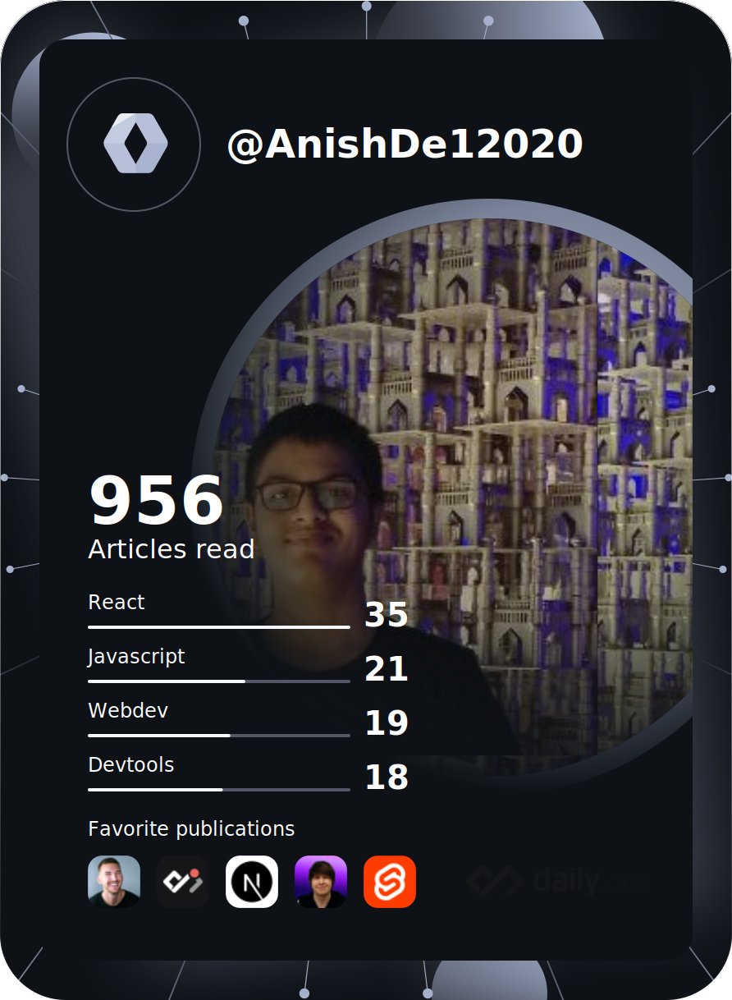

# Hi there, I am Anish 👋

- 🌐 I make web applications and websites
- 💻 I make CLI and TUI tools
- 🪙 I have worked in the web3 space and I am regularly learning new things in the space
- 📝 I write blog posts to spread my knowledge on development and new technologies
- 📖 I am always looking to learn new technologies and expand my knowledge
- 👐 All my projects are open-source and whenever I get the chance to, I contribute to other open-source projects in the form of bug reports, documentation fixes, and code contributions (fixed and new features)

&nbsp;
## 💻 Technologies I Work With

  
See More

  

  

  
## 📱 Apps I use

  
See More

  

  
## ⌨️ My Setup
  

---

 

 

---
  
&nbsp;
## 📊 GitHub Stats

<!-- ---
### My skills (Expanding as I learn more!!!):

         -->

<!-- ---

--- -->
<!-- 

  
  

    
    
  

 -->

<!-- |  |  |
| ----------------------------------------- | ------------------------------------------- | -->

  
  

  
More Metrics

  
<!-- |  |  |
| ----------------------------------------- | ------------------------------------------- | -->
  

  
  

  

  

  
Stat Cards

  

    
    
  

<!-- 

  
  

 -->

<!--   -->

<!-- 

   -->

<!-- 

 -->

## 📰 My Latest Blog Posts
<!-- HASHNODE_BLOG:START -->

<a href="https://blog.anishde.dev//forgit-and-lazygit-the-2-git-tools-to-supercharge-your-git-workflow" title="Forgit and Lazygit. The 2 Git tools to supercharge your git workflow?"><strong>Forgit and Lazygit. The 2 Git tools to supercharge your git workflow?</strong></a>

<strong>23 July 2022</strong>

  Most of us use version control systems (mostly git) for our projects but the git CLI is unproductive. We often need to run multiple commands and got to type more characters. 
Well, what if I told you there are tools that can improve this significantl... 
    

<a href="https://blog.anishde.dev//make-a-beautiful-connect-wallet-button-with-rainbowkit-and-react" title="Make a beautiful Connect Wallet Button with RainbowKit and React"><strong>Make a beautiful Connect Wallet Button with RainbowKit and React</strong></a>

<strong>14 May 2022</strong>

  Authentication in Web3 is extremely easy but supporting all the wallets and making a nice UI can be painful and time-consuming. Thankfully, there are many libraries which makes this extremely easy as well. Today we are going to be looking at adding R... 
    

<a href="https://blog.anishde.dev//5-amazing-react-component-libraries-to-consider-for-your-next-project" title="5 Amazing React Component Libraries to Consider for your Next Project"><strong>5 Amazing React Component Libraries to Consider for your Next Project</strong></a>

<strong>9 May 2022</strong>

  As web developers, it is often quite hard and time-consuming to make accessible UIs. This gets even worse when we have to make special components like Modals or Popovers from scratch.
Thankfully, the React ecosystem is huge and there are many great p... 
    
<!-- HASHNODE_BLOG:END -->

<!-- ### [See More at blog.anishde.dev]() -->
  

  
  

  

